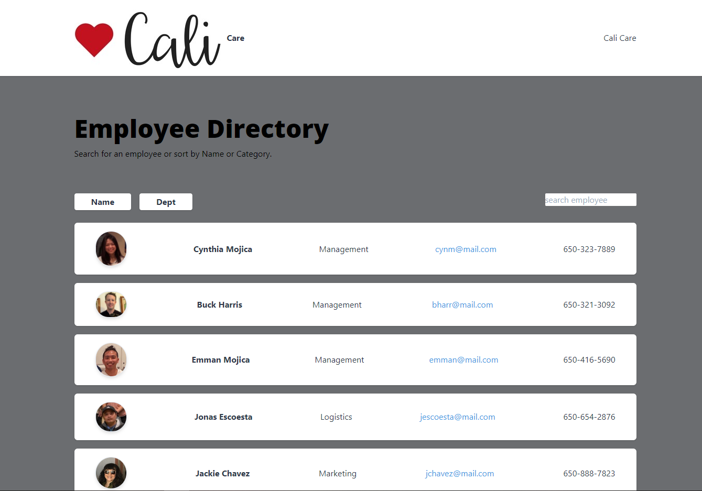

# Employee Directory

## Description
This is an employee directory created with React.

An employee or manager would benefit greatly from being able to view non-sensitive data about other employees. It would be particularly helpful to be able to filter employees by name.

## Acceptance Criteria

Given a table of random users, when the user loads the page, a table of employees should render. 

The user should be able to:

  * Sort the table by at least one category

  * Filter the users by at least one property.

## Table of Contents
* [Installation](#installation) 
 
* [Usage](#usage) 

* [Image](#image)

* [Deploy](#deploy)
 
* [License](#license) 
 
* [Contributing](#contributing) 
 
* [Tests](#tests) 
 

## Installation
​
To install necessary dependencies, run the following command:
​
npm install
​
## Usage
​
Run "npm start" to start the server localhost:3000
​

## Image
​

​

## Deploy
​
To see my work: https://cynmojica1231.github.io/hm19/

## License
​
This project is licensed under the MIT license.

## Tests
​
To run tests, run the following command:
​
​
npm test

